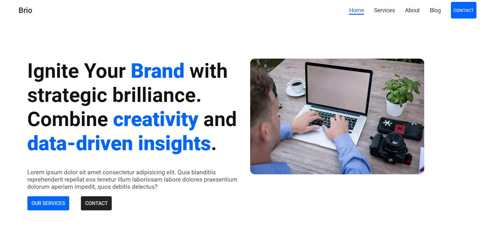
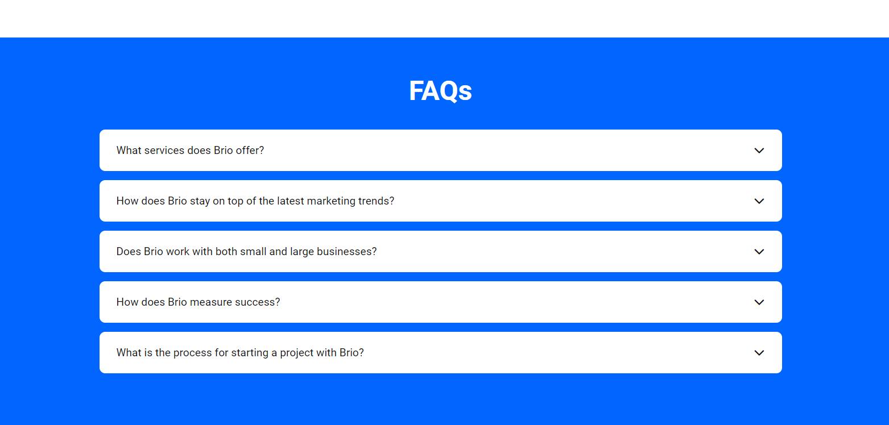

# Description

This project is a fully responsive landing page for a fictional marketing consulting company. The design uses a vibrant and modern color palette, combining soft hues with bold 
accents to create a visually appealing and professional look. Smooth scrolling is implemented for a seamless user experience when navigating through different sections of the page. 
Key features include interactive slides, a clean and modern form, and a dynamic layout that adjusts perfectly across various screen sizes. The page also emphasizes strategic branding 
with creativity and data-driven insights, offering users an engaging and polished digital experience.

# Main Features 
- HTML and CSS
- Responsive design
- Accordions
- Responsive menu

# Screenshot

